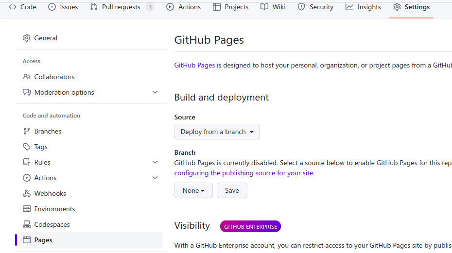

# 📔 Menampilkan Dokumen Dengan Lume

Sebetulnya saat ini sudah sangat banyak _framework_ yang mendukung kreasi dokumen _markdown_
dan kemudian mempublikasikannya dalam bentuk Website.

Tapi dalam hal ini kita akan menampilkannya sebagai GitHub Pages.

Tentu saja cara paling mudah adalah menggunakan tombol-tombol yang ada di GitHub melalui akun
kita sendiri. Yang paling sederhana adalah melalui tombol ⚙ **Settings** yang ada di sebelah kanan
halaman repository kita. Lalu klik menu 'Pages' di panel sebelah kiri. 

.

